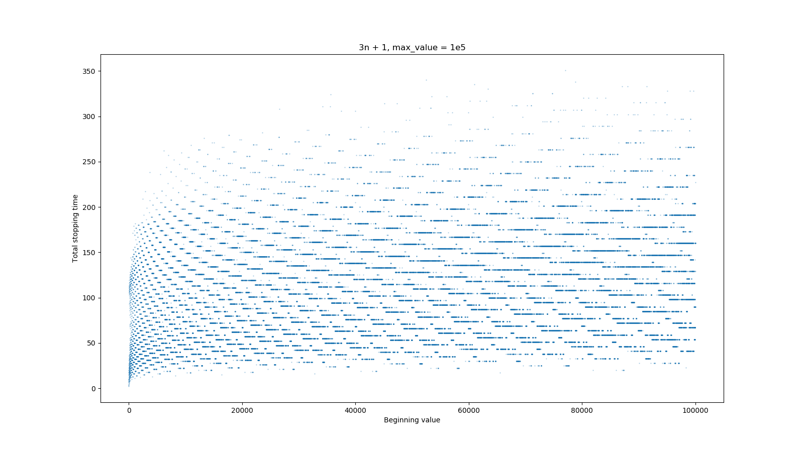
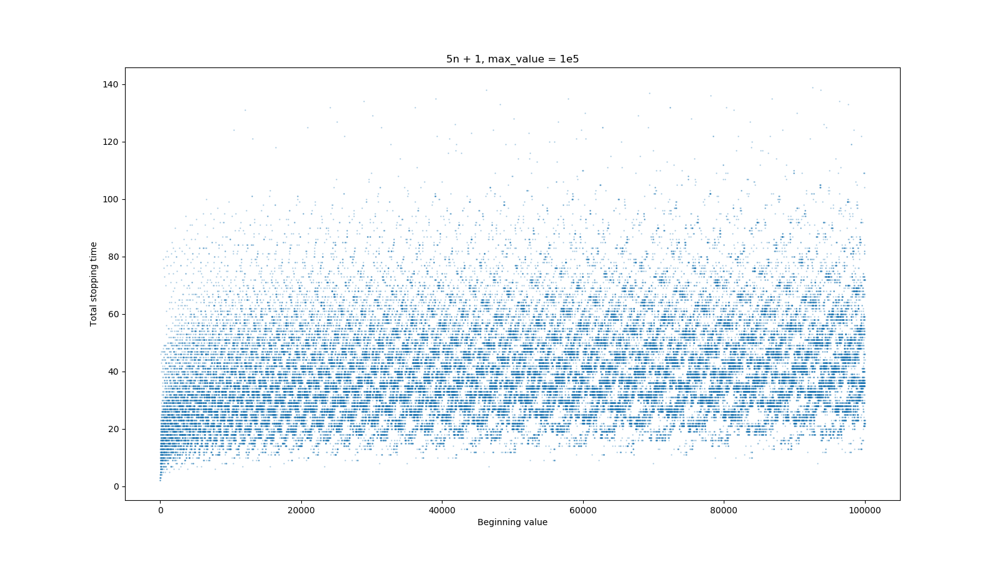
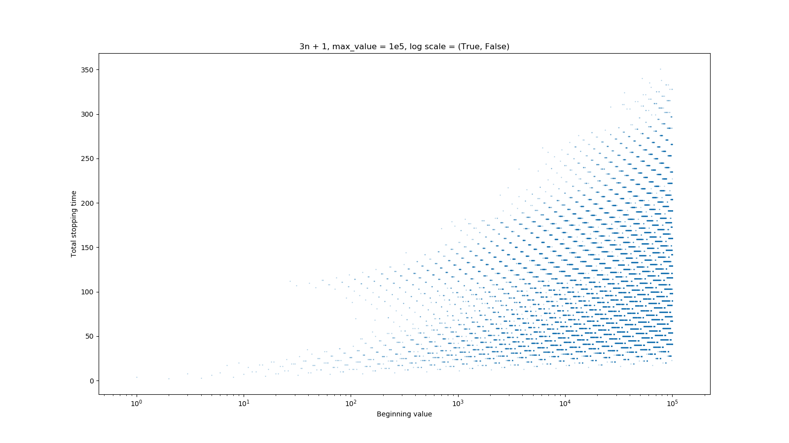
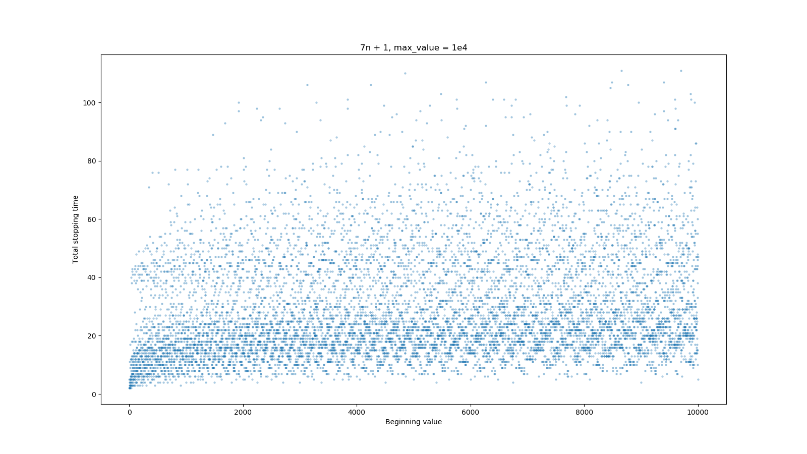

# Visualization of Collatz conjecture and its generalization

This is my visualization and Python source code for Collatz conjecture and a generalization proposed by Zhang Zhongfu and Yang Shiming. 

## Contents
- [Preliminaries](#preliminaries)
- [Important note](#important-note)
- [Examples](#examples)
- [References](#references)

## Preliminaries

- **Collatz conjecture**: [Wikipedia article]
- **Zhongfu and Shiming's generalization**: Introduction of [this paper].

## Important note

The visualization ignores cases where total stopping time exceeds a certain threshold (automatically set 1e4) to save computational resources.

## Examples

**Example 1**

This example plots total stopping time in the original Collatz conjecture for integers from 1 to 1e5 in linear scales.

`main_plot(prime = 3, max_value = 100000)`

**Example 2**

This example plots total stopping time in the case "5n + 1" for integers from 1 to 1e5 in linear scales.

`main_plot(prime = 5, max_value = 100000)`

**Example 3**

This example plots total stopping time in the case "3n + 1" for integers from 1 to 1e5. x axis is in log scale.

`main_plot(prime = 3, max_value = 100000, log_scale = (True, False))`

**Example 4**

This example plots total stopping time in the case "7n + 1" for integers from 1 to 1e4 in linear scales.

`main_plot(prime = 7, max_value = 10000)`

## References

[1]J. Lesieutre, 'On a Generalization of the Collatz Conjecture’, p. 31.

[Wikipedia article]: https://en.wikipedia.org/wiki/Collatz_conjecture
[this paper]: http://web.mit.edu/rsi/www/pdfs/papers/2004/2004-lesjohn.pdf
